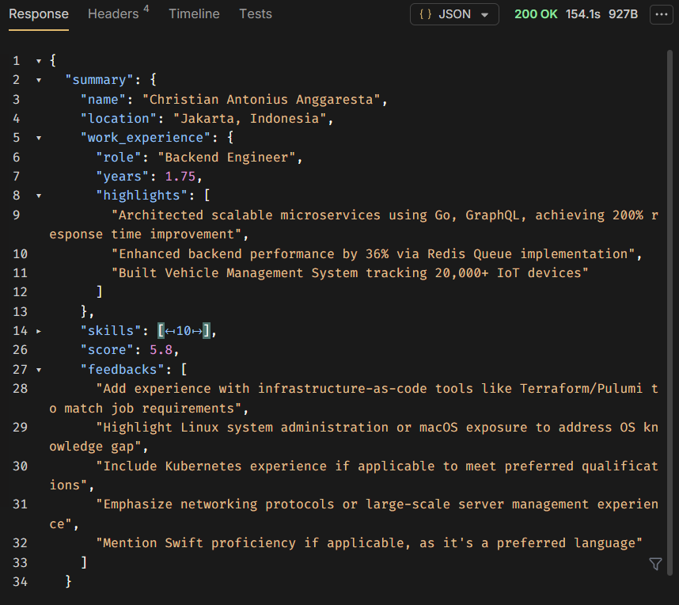

Creator: Christian Antonius Anggaresta

# AI ATS Resume Checker

An intelligent resume analysis API powered by AI that extracts candidate information from PDF resumes and provides ATS (Applicant Tracking System) compatibility checking. The service can analyze resumes standalone or compare them against job postings to provide relevance scores and improvement feedback.


## Features

- **PDF Resume Parsing**: Extracts text content from PDF resume files
- **AI-Powered Analysis**: Uses OpenRouter API with configurable LLM models to analyze resumes
- **Structured Data Extraction**: Extracts candidate name, location, work experience, and skills
- **Job Post Matching**: Optional job posting comparison with relevance scoring (0.0-10.0)
- **ATS Feedback**: Provides actionable feedback to improve resume quality
- **RESTful API**: FastAPI-based API with health check endpoint

## Tech Stack

- **FastAPI**: Modern Python web framework
- **OpenRouter**: LLM API gateway for AI analysis
- **pypdf**: PDF text extraction
- **Pydantic**: Data validation and serialization
- **httpx**: Async HTTP client

## Setup

### 1. Install Dependencies

```bash
pip install -r requirements.txt
```

### 2. Environment Configuration

Create a `.env` file in the project root (or export environment variables):

```env
OPENROUTER_API_KEY=your_openrouter_api_key_here
OPENROUTER_MODEL=deepseek/deepseek-r1-0528:free
OPENROUTER_BASE_URL=https://openrouter.ai/api/v1
REQUEST_TIMEOUT_SECONDS=30
```

**Environment Variables:**
- `OPENROUTER_API_KEY` (required): Your OpenRouter API key
- `OPENROUTER_MODEL` (optional): LLM model to use (default: `deepseek/deepseek-r1-0528:free`)
- `OPENROUTER_BASE_URL` (optional): OpenRouter API base URL (default: `https://openrouter.ai/api/v1`)
- `REQUEST_TIMEOUT_SECONDS` (optional): HTTP request timeout in seconds (default: `30`)

## Running Locally

Start the development server:

```bash
uvicorn app.main:app --reload --port 8000
```

The API will be available at `http://localhost:8000`

API documentation (Swagger UI) will be available at `http://localhost:8000/docs`

## API Endpoints

### Health Check

**GET** `/health`

Check service status.

**Response:**
```json
{
  "status": "ok",
  "app": "Neuram PDF Summarizer"
}
```

### Resume Checker

**POST** `/resume/check`

Analyze a PDF resume and optionally compare it against a job posting.

**Request:**
- **Content-Type**: `multipart/form-data`
- **Parameters**:
  - `file` (required): PDF resume file
  - `job_post` (optional): Job posting text for relevance scoring

**Response:**
```json
{
  "summary": {
    "name": "John Doe",
    "location": "San Francisco, CA",
    "work_experience": {
      "role": "Senior Software Engineer",
      "years": 5.5,
      "highlights": [
      "Led development of microservices architecture",
      "Optimized database queries reducing latency by 40%"
      ]
    },
    "skills": [
      "Python",
      "FastAPI",
      "PostgreSQL",
      "Docker",
      "AWS"
    ],
    "score": 8.5,
    "feedbacks": [
      "Consider adding more quantifiable achievements",
      "Include relevant certifications"
    ]
  }
}
```



**Response Fields:**
- `name`: Candidate name extracted from resume
- `location`: Candidate location
- `work_experience`: 
  - `role`: Most recent or primary role
  - `years`: Years of relevant experience (float)
  - `highlights`: Key achievements and responsibilities
- `skills`: List of technical skills
- `score`: Relevance score (0.0-10.0) - only present if `job_post` is provided
- `feedbacks`: Suggestions to improve resume quality

**Error Responses:**
- `400`: Invalid PDF file or extraction error
- `502`: OpenRouter API error or LLM processing failure
- `500`: Internal server error

## Using Bruno (API Client)

### 1. Environment Configuration

- **Base URL**: `http://localhost:8000`
- Add environment variable:
  - **name**: `baseUrl`
  - **value**: `http://localhost:8000`

Use `{{baseUrl}}` as the prefix in every request.

### 2. Health Check Request

- **Method**: `GET`
- **URL**: `{{baseUrl}}/health`
- **Headers**: `Accept: application/json`

### 3. Resume Checker Request

- **Method**: `POST`
- **URL**: `{{baseUrl}}/resume/check`
- **Body type**: `multipart/form-data`
- **Form fields**:
  - **Key**: `file`
  - **Type**: `File`
  - **Value**: Select your PDF resume file
  - **Key**: `job_post` (optional)
  - **Type**: `Text`
  - **Value**: Job posting description

**Example with cURL:**
```bash
curl -X POST "http://localhost:8000/resume/check" \
  -F "file=@resume.pdf" \
  -F "job_post=We are looking for a Senior Backend Engineer with 5+ years of experience in Python and FastAPI..."
```

## Notes

- **PDF Parsing**: Uses `pypdf` library. Image-heavy PDFs or scanned documents may not extract text properly
- **LLM Models**: Default model is `deepseek/deepseek-r1-0528:free`. You can change it via `OPENROUTER_MODEL` environment variable
- **Error Handling**: Upstream API errors (OpenRouter) are surfaced with `502` status codes
- **Timeout**: Default request timeout is 30 seconds, configurable via `REQUEST_TIMEOUT_SECONDS`
- **Job Post Matching**: When `job_post` is provided, the service calculates a relevance score and provides targeted feedback

## License

Created by Christian Antonius Anggaresta

